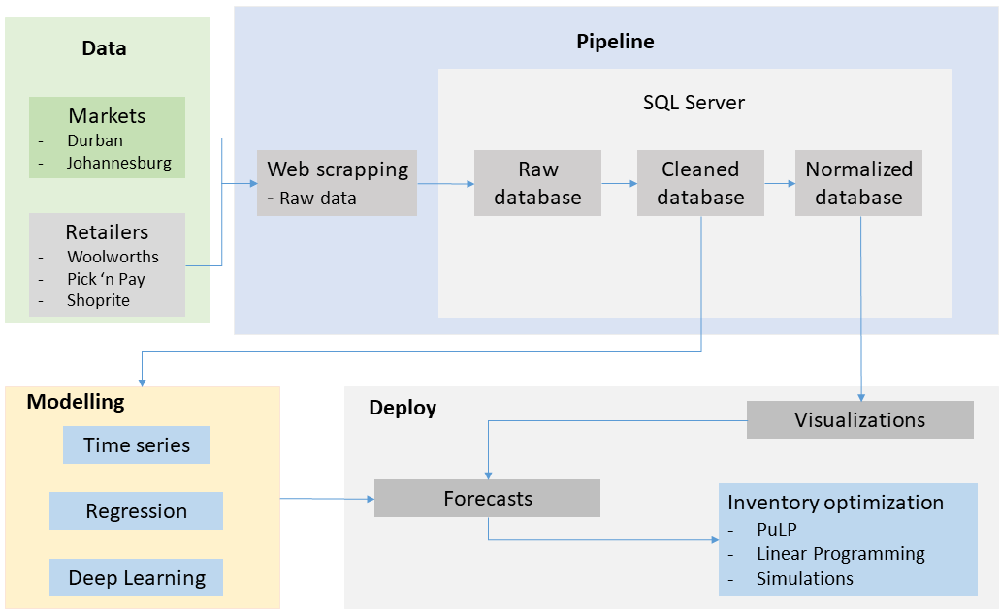
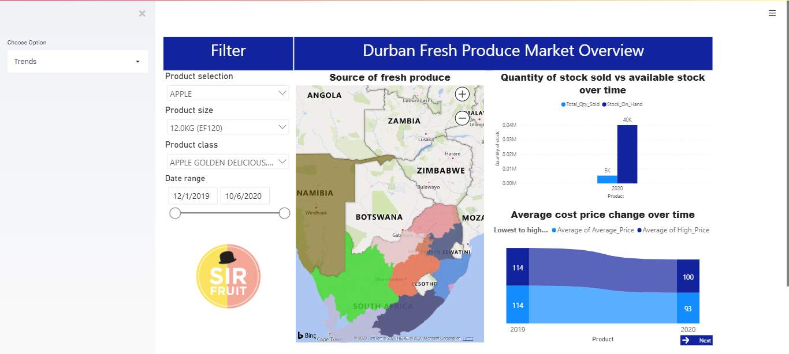
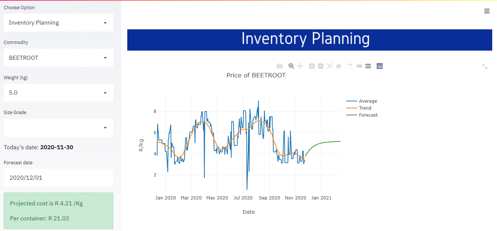
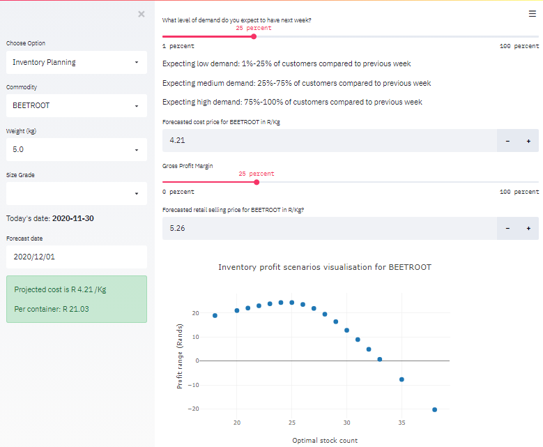

# Inventory Management

## 1. Introduction - A Freshgram analytical approach

Inventory management of perishable goods is a challenge in the retail space, hence having a good inventory management system is vital in managing your resources. With many products currently in the market and demand for these products not constant, retailers end up losing profits due to sales not made or under stocking. 

<p align="center">

</p>

The Freshgram web application will assist retailers in identifying the pricing they need to attach to their products. The application will also assist in predicting the actual stock count for the retailer to be profitable while minimizing food waste.

The web application can be viewed online [here](https://freshgram.herokuapp.com/).
For more details on how to use the web application, see the [user guide](https://docs.google.com/document/d/1bILCLo3VmPTb4jP-B6_Id3VyXQm_iAA__FfAQlDlIis/edit#heading=h.gjdgxs).

## 2. Analytical Framework
The section dives into the analytical framework that was carried through in order to generate the Freshgram web application. The figure below displays an overview of every component of the framework and how they are inter-connected.



### Solutions Approach
- **Data:** The data is acquired from the respective website for the market of the region and the retailer. The Market and Retail data is updated on a daily and weekly basis respectively.

######

- **Pipeline:** The initial phase of the pipeline involved *Web scrapping*, whereby raw data was extracted from the respective websites using Selenium. The information relayed by the Market data included but not limited to Total Sales, Total Quantity Sold, Average Price Per Kilogram, and Total Quantity Remaining. These information was extracted as is online and stored in a database under the *Raw database*. By applying data wrangling techniques, the raw data is converted to a data format that is appropriate for analysis and then stored in the *Cleaned database*. Finally, in order to reduce or eliminate data redundancy, the data is normalized and stored in a *Normalized database*.

######

- **Modelling:** Various models were created for predicting average prices per kilograms for fresh produce products using *Time Series*, *Regression*, and *Deep Learning* models.  

######

- **Deploy:** A PowerBI dashboard is used for visualizations, these dashboards are embedded onto a Streamlit web application, generating forecasts and inventory optimization analysis.

## 3. Freshgram web application
The web application has two options, below is the snap shot of the **trend** option which makes use of PowerBI dashboards for visualizations. The information relayed on the dashboards include, based on the product of interest over a specified period, the change in average pricing as well as pricing range, quantity sold, and quantity remaining in inventory.



The **inventory planning** option of the web application makes use of predictions of fresh produce products. Here the user can select the a particular day of interest in the future date and forecasted costs of the product will be returned as per kilogram and per container cost.



The inventory optimization section makes use of Linear programming to maximize profit for the retailer. This is based on projected demand of the product, the gross profit margin the retailer hopes to achieve and as a result the quantity of the products the retailer needs to purchase in order to meet the target gross profit margin. 



## 4. Getting Started
This section is a step-by-step guide on how to launch the Freshgram web application on your local machine. This assumes an Anaconda environment is already installed on your local machine.
```
git clone https://github.com/scmosoeu/fresh_produce.git
```
Access the repo on your Anaconda terminal
```
cd fresh_produce
```
Once inside the repo, run the following command on your terminal to install the virtual environment as well as the supporting packages.
```
conda env create -f environment.yaml
```
Activate the environment
```
conda activate fresh_produce
```
Once the virtual environment has been activated the web application is ready to be launched.
```
streamlit run Inventory-Data-Streamlit-App-master/Inventory_Planner_Demo.py
```
or
```
cd Inventory-Data-Streamlit-App-master
streamlit run Inventory_Planner_Demo.py
```
